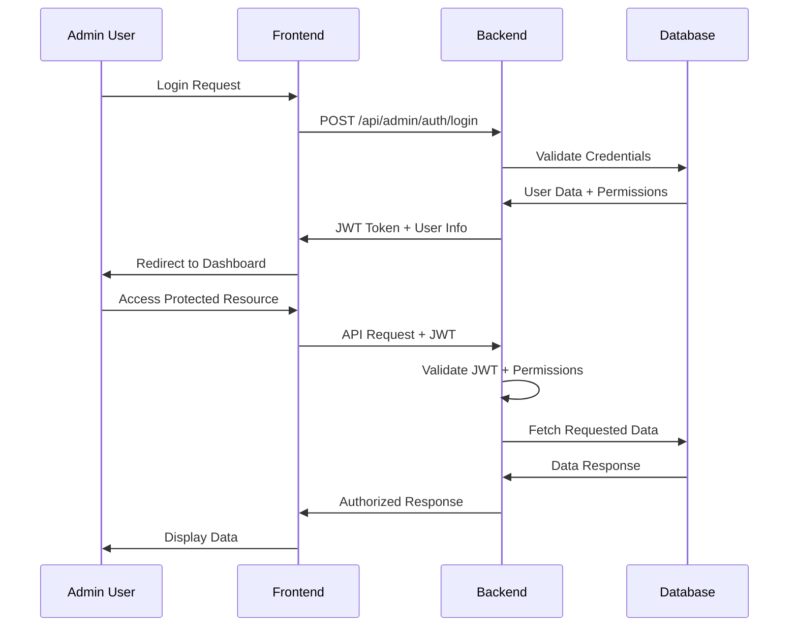
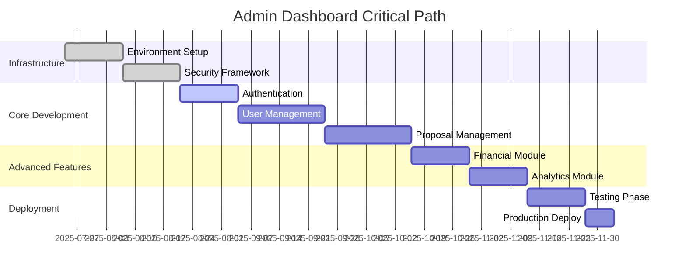
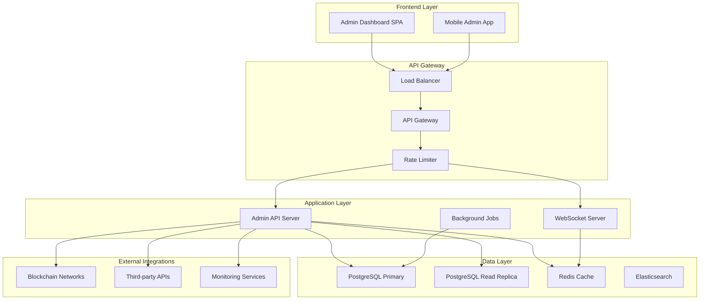
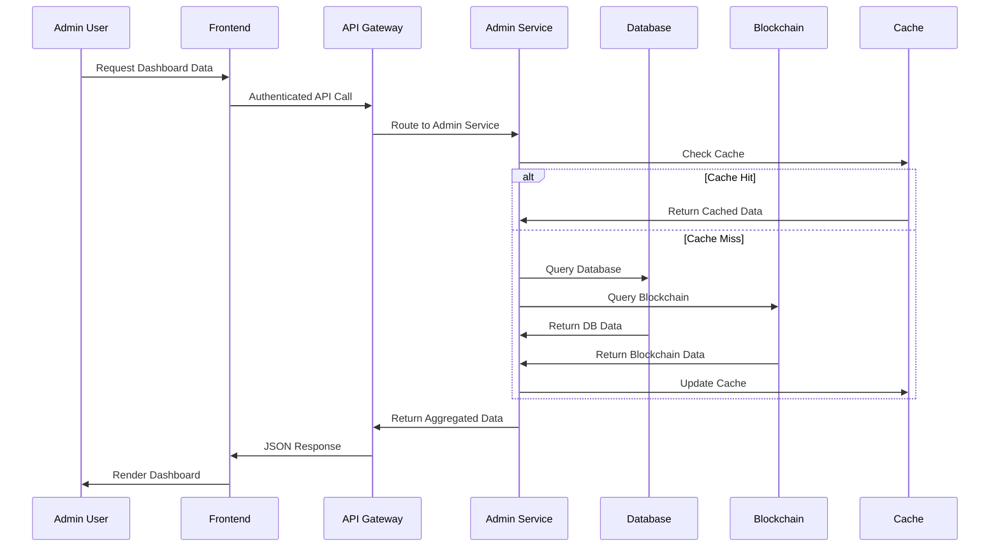

# Product Requirements Document (PRD)
# Ganjes NFT DAO - Admin Section

**Document Version**: 1.0  
**Date**: July 24, 2025  
**Product**: Ganjes NFT DAO Platform  
**Feature**: Admin Management Dashboard  
**Author**: Product Development Team  

---

## 📋 Table of Contents

1. [Executive Summary](#executive-summary)
2. [Problem Statement](#problem-statement)
3. [Product Overview](#product-overview)
4. [User Personas](#user-personas)
5. [Functional Requirements](#functional-requirements)
6. [Non-Functional Requirements](#non-functional-requirements)
7. [User Stories](#user-stories)
8. [Technical Specifications](#technical-specifications)
9. [Security Requirements](#security-requirements)
10. [UI/UX Requirements](#uiux-requirements)
11. [Integration Requirements](#integration-requirements)
12. [Success Metrics](#success-metrics)
13. [Timeline & Milestones](#timeline--milestones)
14. [Risk Assessment](#risk-assessment)
15. [Appendices](#appendices)

---

## 📊 Executive Summary

### Vision Statement
Create a comprehensive administrative dashboard that empowers DAO administrators to efficiently manage the Ganjes NFT platform, oversee governance operations, monitor system health, and maintain platform security while ensuring transparent and decentralized decision-making.

### Key Objectives
- **Operational Efficiency**: Streamline DAO management tasks and reduce administrative overhead
- **Enhanced Governance**: Provide tools for effective proposal lifecycle management
- **Security & Compliance**: Implement robust security controls and audit capabilities
- **Data-Driven Decisions**: Offer comprehensive analytics and reporting features
- **User Experience**: Deliver an intuitive, responsive admin interface

### Expected Impact
- **50% reduction** in manual administrative tasks
- **75% faster** proposal processing and execution
- **99.9% uptime** through proactive system monitoring
- **100% audit compliance** with comprehensive logging
- **Enhanced security** through advanced access controls

---

## 🎯 Problem Statement

### Current Challenges

#### 1. **Fragmented Management**
- Administrators currently manage the DAO through multiple interfaces
- No centralized view of platform health and metrics
- Manual processes for common administrative tasks

#### 2. **Limited Oversight**
- Insufficient visibility into user activities and proposal lifecycle
- Lack of comprehensive audit trails
- No proactive alerting for critical issues

#### 3. **Security Gaps**
- Basic access controls without granular permissions
- Limited monitoring of suspicious activities
- Manual security incident response

#### 4. **Scalability Concerns**
- Current tools don't scale with growing user base
- Performance bottlenecks in data retrieval and analysis
- Inefficient resource allocation

### Target Users Impacted
- **DAO Administrators** (Primary): 5-10 users managing daily operations
- **Security Officers** (Secondary): 2-3 users monitoring platform security
- **Analytics Teams** (Secondary): 3-5 users analyzing platform performance
- **Compliance Officers** (Tertiary): 1-2 users ensuring regulatory compliance

---

## 🏗️ Product Overview

### Core Value Proposition
A unified administrative dashboard that provides comprehensive DAO management capabilities, real-time monitoring, advanced analytics, and robust security controls to ensure efficient and secure platform operations.

### Key Features Summary

| Feature Category | Primary Features | Business Value |
|------------------|------------------|----------------|
| **Dashboard & Analytics** | Real-time metrics, KPI tracking, custom reports | Data-driven decision making |
| **User Management** | User roles, permissions, profile management | Enhanced security & control |
| **Proposal Management** | Lifecycle tracking, batch operations, approval workflows | Operational efficiency |
| **Financial Management** | Treasury oversight, transaction monitoring, fund allocation | Financial transparency |
| **Security & Compliance** | Audit logs, security monitoring, compliance reports | Risk mitigation |
| **System Management** | Configuration, monitoring, maintenance tools | Platform reliability |

### Success Criteria
- **Adoption Rate**: 100% of admin users actively using the dashboard within 30 days
- **Task Efficiency**: 50% reduction in time spent on administrative tasks
- **System Reliability**: 99.9% uptime with proactive issue detection
- **User Satisfaction**: 4.5+ rating in admin user feedback surveys
- **Security Posture**: Zero security incidents related to admin access

---

## 👥 User Personas

### Primary Persona: DAO Administrator (Sarah)
**Role**: Senior DAO Administrator  
**Experience**: 3+ years in blockchain/DeFi governance  
**Goals**:
- Efficiently manage daily DAO operations
- Ensure platform security and compliance
- Monitor key performance indicators
- Facilitate smooth proposal lifecycle management

**Pain Points**:
- Switching between multiple tools for different tasks
- Lack of real-time visibility into platform health
- Manual processes that are time-consuming and error-prone
- Difficulty in generating comprehensive reports

**Technical Proficiency**: High - Comfortable with complex dashboards and technical metrics

### Secondary Persona: Security Officer (Marcus)
**Role**: Platform Security Specialist  
**Experience**: 5+ years in cybersecurity, 2+ years in DeFi  
**Goals**:
- Monitor and respond to security threats
- Maintain compliance with security standards
- Conduct regular security audits
- Implement and manage access controls

**Pain Points**:
- Limited visibility into user activities and system events
- Reactive rather than proactive security monitoring
- Difficulty in correlating security events across systems
- Manual incident response processes

**Technical Proficiency**: Expert - Requires detailed technical data and advanced controls

### Tertiary Persona: Analytics Specialist (Emma)
**Role**: Data Analyst  
**Experience**: 4+ years in data analysis, 1+ year in blockchain analytics  
**Goals**:
- Generate insights from platform data
- Create custom reports for stakeholders
- Track user engagement and platform growth
- Identify trends and opportunities

**Pain Points**:
- Limited access to raw data and analytics tools
- Difficulty in creating custom visualizations
- Lack of automated reporting capabilities
- Inconsistent data formats across systems

**Technical Proficiency**: High - Proficient in data analysis tools and techniques

---

## ⚙️ Functional Requirements

### 1. Dashboard & Analytics Module

#### 1.1 Real-Time Dashboard
**Priority**: High  
**Description**: Centralized dashboard displaying key metrics and system status

**Features**:
- **System Health Overview**
  - Server status indicators
  - Database connection status
  - Blockchain network connectivity
  - API response times and error rates

- **Key Performance Indicators**
  - Total active users (daily/weekly/monthly)
  - Proposal submission rate
  - Voting participation rate
  - Treasury balance and transactions
  - Platform revenue metrics

- **Activity Feed**
  - Recent user registrations
  - New proposal submissions
  - Completed votes and executions
  - Security alerts and warnings

- **Quick Actions Panel**
  - Emergency system controls
  - Bulk operation shortcuts
  - Notification management
  - Support ticket creation

#### 1.2 Advanced Analytics
**Priority**: High  
**Description**: Comprehensive analytics and reporting capabilities

**Features**:
- **User Analytics**
  - User growth trends and cohort analysis
  - User engagement metrics and behavior patterns
  - Geographic distribution and demographics
  - User lifetime value calculations

- **Proposal Analytics**
  - Proposal success/failure rates
  - Average voting times and participation
  - Category-wise proposal distribution
  - Funding request vs. approval analysis

- **Financial Analytics**
  - Treasury growth and allocation trends
  - Token circulation and distribution
  - Revenue streams and profitability
  - Cost center analysis and optimization

- **Performance Analytics**
  - System performance metrics and trends
  - API usage patterns and optimization
  - User experience metrics (load times, errors)
  - Mobile vs. desktop usage statistics

#### 1.3 Custom Reporting
**Priority**: Medium  
**Description**: Flexible reporting system for generating custom reports

**Features**:
- **Report Builder**
  - Drag-and-drop interface for creating reports
  - Multiple data sources and visualization types
  - Custom filters and date ranges
  - Scheduled report generation and delivery

- **Export Capabilities**
  - PDF, Excel, CSV export formats
  - API endpoints for programmatic access
  - Email scheduling and distribution
  - Dashboard embedding for external use

### 2. User Management Module

#### 2.1 User Directory
**Priority**: High  
**Description**: Comprehensive user management and profile oversight

**Features**:
- **User Profiles**
  - Complete user information and verification status
  - Activity history and engagement metrics
  - Token holdings and transaction history
  - Account security settings and two-factor authentication

- **Search & Filtering**
  - Advanced search with multiple criteria
  - Filter by role, status, registration date
  - Bulk selection and operations
  - Export user lists and data

- **User Actions**
  - Account activation/deactivation
  - Role assignment and modification
  - Password reset and security controls
  - Account merging and data migration

#### 2.2 Role & Permission Management
**Priority**: High  
**Description**: Granular access control and permission management

**Features**:
- **Role Definition**
  - Create and modify user roles
  - Assign permissions to roles
  - Role hierarchy and inheritance
  - Custom role creation for specific needs

- **Permission Matrix**
  - Visual permission assignment interface
  - Granular permissions for each feature
  - Bulk permission updates
  - Permission audit and compliance tracking

- **Access Control**
  - IP-based access restrictions
  - Time-based access controls
  - Multi-factor authentication requirements
  - Session management and timeout controls

#### 2.3 User Communication
**Priority**: Medium  
**Description**: Communication tools for user engagement and support

**Features**:
- **Messaging System**
  - Direct messaging to users or groups
  - Broadcast announcements and updates
  - Message templates and automation
  - Delivery confirmation and read receipts

- **Notification Management**
  - System-wide notification controls
  - User notification preferences
  - Push notification configuration
  - Email template management

### 3. Proposal Management Module

#### 3.1 Proposal Oversight
**Priority**: High  
**Description**: Comprehensive proposal lifecycle management

**Features**:
- **Proposal Dashboard**
  - All proposals with status indicators
  - Filter by status, category, date, proposer
  - Bulk operations and batch processing
  - Proposal timeline and milestone tracking

- **Proposal Details**
  - Complete proposal information and attachments
  - Voting progress and participant details
  - Financial impact and fund allocation
  - Comments and discussion threads

- **Administrative Actions**
  - Proposal approval/rejection workflow
  - Emergency proposal suspension
  - Proposal category and tag management
  - Duplicate detection and merge capabilities

#### 3.2 Voting Management
**Priority**: High  
**Description**: Voting process oversight and integrity assurance

**Features**:
- **Vote Monitoring**
  - Real-time voting progress tracking
  - Voter participation and engagement metrics
  - Vote distribution and pattern analysis
  - Suspicious voting activity detection

- **Vote Validation**
  - Vote integrity verification
  - Duplicate vote detection and prevention
  - Voter eligibility confirmation
  - Audit trail for all voting activities

- **Voting Configuration**
  - Voting period and quorum settings
  - Voting weight and delegation rules
  - Emergency voting procedures
  - Voting result calculation methods

#### 3.3 Proposal Analytics
**Priority**: Medium  
**Description**: Analytics and insights for proposal performance

**Features**:
- **Success Metrics**
  - Proposal approval rates by category
  - Average voting participation
  - Time-to-decision analysis
  - Proposer success rate tracking

- **Trend Analysis**
  - Proposal volume and seasonality
  - Category popularity and trends
  - Funding request patterns
  - Geographic proposal distribution

### 4. Financial Management Module

#### 4.1 Treasury Management
**Priority**: High  
**Description**: Complete oversight of DAO treasury and financial operations

**Features**:
- **Treasury Dashboard**
  - Real-time balance and asset allocation
  - Portfolio performance and valuation
  - Risk metrics and exposure analysis
  - Liquidity monitoring and forecasting

- **Transaction Monitoring**
  - All incoming and outgoing transactions
  - Transaction categorization and tagging
  - Suspicious transaction detection
  - Multi-signature wallet management

- **Fund Allocation**
  - Budget creation and management
  - Expense tracking and reporting
  - Fund allocation to approved proposals
  - Reserve fund management

#### 4.2 Financial Reporting
**Priority**: High  
**Description**: Comprehensive financial reporting and compliance

**Features**:
- **Standard Reports**
  - Profit & Loss statements
  - Balance sheets and cash flow
  - Budget vs. actual analysis
  - Tax reporting and compliance

- **Custom Financial Reports**
  - Flexible report builder for financial data
  - Multi-currency support and conversion
  - Historical data analysis and trends
  - Stakeholder-specific reporting

#### 4.3 Risk Management
**Priority**: Medium  
**Description**: Financial risk assessment and mitigation tools

**Features**:
- **Risk Monitoring**
  - Portfolio risk assessment
  - Exposure limits and alerts
  - Market volatility impact analysis
  - Counter-party risk evaluation

- **Compliance Tracking**
  - Regulatory compliance monitoring
  - AML/KYC requirement tracking
  - Tax obligation management
  - Audit preparation and documentation

### 5. Security & Compliance Module

#### 5.1 Security Monitoring
**Priority**: High  
**Description**: Comprehensive security monitoring and incident response

**Features**:
- **Security Dashboard**
  - Real-time security status overview
  - Active threats and alert summary
  - Security metrics and trends
  - Incident response status tracking

- **Threat Detection**
  - Automated anomaly detection
  - Suspicious activity pattern recognition
  - Brute force attack monitoring
  - Phishing and social engineering alerts

- **Access Monitoring**
  - Login attempt tracking and analysis
  - Privileged access monitoring
  - Session management and timeouts
  - Geo-location based access controls

#### 5.2 Audit & Compliance
**Priority**: High  
**Description**: Audit trail management and compliance reporting

**Features**:
- **Audit Logs**
  - Comprehensive activity logging
  - Immutable audit trail storage
  - Log search and filtering capabilities
  - Automated log retention policies

- **Compliance Reporting**
  - Regulatory compliance dashboards
  - Automated compliance checking
  - Violation detection and alerting
  - Compliance report generation

- **Data Privacy**
  - GDPR compliance tools
  - Data retention and deletion policies
  - User consent management
  - Privacy impact assessments

#### 5.3 Incident Response
**Priority**: Medium  
**Description**: Security incident management and response coordination

**Features**:
- **Incident Management**
  - Incident detection and classification
  - Automated response workflows
  - Escalation procedures and notifications
  - Recovery and remediation tracking

- **Forensic Tools**
  - Digital forensics capabilities
  - Evidence collection and preservation
  - Timeline reconstruction
  - Impact assessment and reporting

### 6. System Management Module

#### 6.1 System Configuration
**Priority**: High  
**Description**: Platform configuration and parameter management

**Features**:
- **Global Settings**
  - Platform-wide configuration parameters
  - Feature flags and experimental controls
  - Maintenance mode and system announcements
  - API rate limiting and throttling

- **Smart Contract Management**
  - Contract deployment and upgrade management
  - Parameter updates and governance
  - Contract interaction monitoring
  - Gas optimization and cost management

#### 6.2 System Monitoring
**Priority**: High  
**Description**: Infrastructure monitoring and performance optimization

**Features**:
- **Performance Monitoring**
  - System resource utilization
  - Database performance metrics
  - API response times and throughput
  - User experience monitoring

- **Alert Management**
  - Configurable alert thresholds
  - Multi-channel alert delivery
  - Alert escalation procedures
  - Alert acknowledgment and resolution

#### 6.3 Maintenance & Updates
**Priority**: Medium  
**Description**: System maintenance and update management

**Features**:
- **Update Management**
  - Scheduled maintenance windows
  - Feature rollout and rollback
  - Database migration management
  - Third-party integration updates

- **Backup & Recovery**
  - Automated backup scheduling
  - Disaster recovery procedures
  - Data restoration capabilities
  - Business continuity planning

---

## 🚀 Non-Functional Requirements

### Performance Requirements

| Metric | Target | Critical Threshold |
|--------|--------|-------------------|
| Page Load Time | < 3 seconds | < 5 seconds |
| API Response Time | < 500ms | < 1 second |
| Dashboard Refresh | < 2 seconds | < 5 seconds |
| Report Generation | < 30 seconds | < 60 seconds |
| Search Response | < 1 second | < 3 seconds |
| Concurrent Users | 100+ admins | 50+ admins |

### Scalability Requirements
- **User Growth**: Support 10x increase in platform users without performance degradation
- **Data Volume**: Handle 100x increase in transaction and log data
- **Geographic Expansion**: Support multiple regions with < 200ms latency
- **Feature Expansion**: Modular architecture for easy feature additions

### Reliability Requirements
- **Uptime**: 99.9% availability (< 8.77 hours downtime per year)
- **Data Integrity**: 100% data consistency across all operations
- **Backup Recovery**: < 4 hours Recovery Time Objective (RTO)
- **Disaster Recovery**: < 24 hours Recovery Point Objective (RPO)

### Security Requirements
- **Authentication**: Multi-factor authentication for all admin accounts
- **Authorization**: Role-based access control with granular permissions
- **Data Encryption**: AES-256 encryption for data at rest and in transit
- **Audit Logging**: Immutable audit trails for all administrative actions
- **Compliance**: SOC 2 Type II and ISO 27001 compliance readiness

### Usability Requirements
- **Learning Curve**: < 2 hours for proficient platform users
- **Task Completion**: 95% task completion rate for common operations
- **Error Prevention**: Confirmation dialogs for destructive actions
- **Accessibility**: WCAG 2.1 AA compliance for accessibility

---

## 📖 User Stories

### Epic 1: Dashboard & Analytics

#### Story 1.1: Real-Time System Overview
**As a** DAO Administrator  
**I want to** see a real-time overview of system health and key metrics  
**So that** I can quickly identify and respond to issues or opportunities

**Acceptance Criteria**:
- Dashboard loads within 3 seconds
- Displays current system status (online/offline/degraded)
- Shows key metrics: active users, proposals, treasury balance
- Updates automatically every 30 seconds
- Provides drill-down capability for detailed analysis

**Priority**: High  
**Story Points**: 13

#### Story 1.2: Custom Analytics Reports
**As an** Analytics Specialist  
**I want to** create custom reports with flexible data visualization  
**So that** I can generate insights specific to stakeholder needs

**Acceptance Criteria**:
- Drag-and-drop report builder interface
- Support for multiple chart types and data sources
- Ability to save and share custom reports
- Export functionality for PDF, Excel, and CSV formats
- Scheduled report generation and email delivery

**Priority**: Medium  
**Story Points**: 21

### Epic 2: User Management

#### Story 2.1: User Profile Management
**As a** DAO Administrator  
**I want to** view and manage comprehensive user profiles  
**So that** I can provide better support and ensure platform security

**Acceptance Criteria**:
- Complete user profile with all relevant information
- Activity history and engagement metrics
- Ability to update user information and settings
- Security controls (account lock, password reset)
- Bulk operations for multiple users

**Priority**: High  
**Story Points**: 8

#### Story 2.2: Role-Based Access Control
**As a** Security Officer  
**I want to** define and manage user roles with granular permissions  
**So that** I can ensure appropriate access control and security

**Acceptance Criteria**:
- Create custom roles with specific permissions
- Visual permission matrix for easy management
- Role inheritance and hierarchy support
- Audit trail for all permission changes
- Emergency access controls and overrides

**Priority**: High  
**Story Points**: 13

### Epic 3: Proposal Management

#### Story 3.1: Proposal Lifecycle Tracking
**As a** DAO Administrator  
**I want to** track proposals through their entire lifecycle  
**So that** I can ensure efficient processing and decision-making

**Acceptance Criteria**:
- Complete proposal timeline with all milestones
- Status indicators and progress tracking
- Automated notifications for key events
- Ability to expedite or hold proposals
- Bulk operations for multiple proposals

**Priority**: High  
**Story Points**: 13

#### Story 3.2: Voting Integrity Monitoring
**As a** Security Officer  
**I want to** monitor voting activities for suspicious patterns  
**So that** I can ensure voting integrity and prevent manipulation

**Acceptance Criteria**:
- Real-time voting activity monitoring
- Anomaly detection for unusual voting patterns
- Voter eligibility verification
- Duplicate vote prevention and detection
- Comprehensive audit trail for all votes

**Priority**: High  
**Story Points**: 21

### Epic 4: Financial Management

#### Story 4.1: Treasury Oversight
**As a** DAO Administrator  
**I want to** monitor and manage the DAO treasury  
**So that** I can ensure financial transparency and proper fund allocation

**Acceptance Criteria**:
- Real-time treasury balance and composition
- Transaction history with categorization
- Budget tracking and variance analysis
- Multi-signature wallet management
- Financial reporting and compliance tools

**Priority**: High  
**Story Points**: 21

### Epic 5: Security & Compliance

#### Story 5.1: Security Incident Response
**As a** Security Officer  
**I want to** detect and respond to security incidents quickly  
**So that** I can minimize impact and maintain platform security

**Acceptance Criteria**:
- Automated threat detection and alerting
- Incident classification and prioritization
- Response workflow automation
- Communication and escalation procedures
- Post-incident analysis and reporting

**Priority**: High  
**Story Points**: 34

---

## 🛠️ Technical Specifications

### Architecture Overview

#### Frontend Architecture
```
Admin Dashboard Frontend
├── React 19.1.0 + TypeScript
├── State Management: Redux Toolkit + RTK Query
├── UI Framework: Material-UI v5 + Custom Components
├── Charts & Visualization: Recharts + D3.js
├── Real-time Updates: Socket.io-client
├── Security: JWT + Role-based routing
└── Testing: Jest + React Testing Library
```

#### Backend Architecture
```
Admin API Backend
├── Node.js + Express.js + TypeScript
├── Database: PostgreSQL + Redis (caching)
├── Authentication: JWT + OAuth 2.0
├── Real-time: Socket.io
├── Background Jobs: Bull Queue + Redis
├── Monitoring: Prometheus + Grafana
└── Logging: Winston + ELK Stack
```

#### Infrastructure Architecture
```
Cloud Infrastructure (AWS)
├── Application: ECS Fargate + ALB
├── Database: RDS PostgreSQL + ElastiCache Redis
├── Storage: S3 + CloudFront CDN
├── Monitoring: CloudWatch + X-Ray
├── Security: WAF + Secrets Manager
└── CI/CD: CodePipeline + CodeBuild
```

### Database Schema

#### Core Admin Tables
```sql
-- Admin Users
CREATE TABLE admin_users (
    id UUID PRIMARY KEY DEFAULT gen_random_uuid(),
    email VARCHAR(255) UNIQUE NOT NULL,
    password_hash VARCHAR(255) NOT NULL,
    role_id UUID REFERENCES admin_roles(id),
    created_at TIMESTAMP DEFAULT NOW(),
    updated_at TIMESTAMP DEFAULT NOW(),
    last_login TIMESTAMP,
    is_active BOOLEAN DEFAULT TRUE,
    two_factor_enabled BOOLEAN DEFAULT FALSE
);

-- Admin Roles
CREATE TABLE admin_roles (
    id UUID PRIMARY KEY DEFAULT gen_random_uuid(),
    name VARCHAR(100) UNIQUE NOT NULL,
    description TEXT,
    permissions JSONB NOT NULL,
    created_at TIMESTAMP DEFAULT NOW(),
    updated_at TIMESTAMP DEFAULT NOW()
);

-- Audit Logs
CREATE TABLE audit_logs (
    id UUID PRIMARY KEY DEFAULT gen_random_uuid(),
    user_id UUID REFERENCES admin_users(id),
    action VARCHAR(100) NOT NULL,
    resource_type VARCHAR(100) NOT NULL,
    resource_id VARCHAR(255),
    old_values JSONB,
    new_values JSONB,
    ip_address INET,
    user_agent TEXT,
    created_at TIMESTAMP DEFAULT NOW()
);

-- System Configuration
CREATE TABLE system_config (
    id UUID PRIMARY KEY DEFAULT gen_random_uuid(),
    key VARCHAR(255) UNIQUE NOT NULL,
    value JSONB NOT NULL,
    description TEXT,
    updated_by UUID REFERENCES admin_users(id),
    updated_at TIMESTAMP DEFAULT NOW()
);
```

### API Specifications

#### Authentication Endpoints
```typescript
// Admin Authentication
POST /api/admin/auth/login
POST /api/admin/auth/logout  
POST /api/admin/auth/refresh
POST /api/admin/auth/forgot-password
POST /api/admin/auth/reset-password
GET  /api/admin/auth/me
```

#### Dashboard Endpoints
```typescript
// Dashboard Data
GET  /api/admin/statistics
GET  /api/admin/statistics
GET  /api/admin/statistics
GET  /api/admin/statistics
```

#### User Management Endpoints
```typescript
// User Management
GET    /api/admin/users
GET    /api/admin/users/:id
PUT    /api/admin/users/:id
DELETE /api/admin/users/:id
POST   /api/admin/users/:id/activate
POST   /api/admin/users/:id/deactivate
GET    /api/admin/roles
POST   /api/admin/roles
PUT    /api/admin/roles/:id
```

#### Proposal Management Endpoints
```typescript
// Proposal Management
GET    /api/admin/proposals
GET    /api/admin/proposals/:id
PUT    /api/admin/proposals/:id
POST   /api/admin/proposals/:id/approve
POST   /api/admin/proposals/:id/reject
POST   /api/admin/proposals/:id/execute
GET    /api/admin/proposals/:id/votes
```

### Security Architecture

#### Authentication & Authorization Flow


#### Permission Matrix
```typescript
interface AdminPermissions {
  // Dashboard
  'dashboard:view': boolean;
  'analytics:view': boolean;
  'reports:create': boolean;
  
  // User Management
  'users:view': boolean;
  'users:edit': boolean;
  'users:delete': boolean;
  'roles:manage': boolean;
  
  // Proposal Management
  'proposals:view': boolean;
  'proposals:approve': boolean;
  'proposals:execute': boolean;
  
  // Financial Management
  'treasury:view': boolean;
  'treasury:manage': boolean;
  'transactions:view': boolean;
  
  // Security & Compliance
  'security:monitor': boolean;
  'audit:view': boolean;
  'compliance:manage': boolean;
  
  // System Management
  'system:configure': boolean;
  'system:monitor': boolean;
  'maintenance:perform': boolean;
}
```

### Integration Points

#### Blockchain Integration
```typescript
// Smart Contract Integration
interface ContractIntegration {
  // Proposal Contract
  getProposal(id: number): Promise<ProposalData>;
  executeProposal(id: number): Promise<TransactionResult>;
  
  // DAO Token Contract
  getTokenBalance(address: string): Promise<BigNumber>;
  getTotalSupply(): Promise<BigNumber>;
  
  // Treasury Contract
  getTreasuryBalance(): Promise<BigNumber>;
  withdrawFunds(amount: BigNumber, to: string): Promise<TransactionResult>;
}
```

#### External APIs
```typescript
// Third-party Integrations
interface ExternalAPIs {
  // Price Data
  coinGecko: PriceDataAPI;
  coinMarketCap: PriceDataAPI;
  
  // Analytics
  googleAnalytics: AnalyticsAPI;
  mixpanel: EventTrackingAPI;
  
  // Communication
  sendGrid: EmailAPI;
  twilio: SMSAPI;
  slack: NotificationAPI;
  
  // Security
  recaptcha: CaptchaAPI;
  auth0: AuthenticationAPI;
}
```

---

## 🔒 Security Requirements

### Authentication Security

#### Multi-Factor Authentication (MFA)
- **Requirement**: All admin accounts MUST use MFA
- **Supported Methods**: TOTP (Google Authenticator, Authy), SMS, Email
- **Backup Codes**: Generate and securely store recovery codes
- **Enforcement**: Block access without MFA verification

#### Session Management
- **Session Timeout**: 30 minutes of inactivity
- **Session Renewal**: Automatic renewal with user activity
- **Concurrent Sessions**: Limit to 3 active sessions per admin
- **Session Invalidation**: Immediate logout on suspicious activity

#### Password Security
- **Complexity**: Minimum 12 characters, mixed case, numbers, symbols
- **History**: Prevent reuse of last 12 passwords
- **Expiration**: Force password change every 90 days
- **Breach Detection**: Check against known compromised password databases

### Authorization Security

#### Role-Based Access Control (RBAC)
- **Principle of Least Privilege**: Grant minimum necessary permissions
- **Role Hierarchy**: Support for role inheritance and delegation
- **Permission Granularity**: Feature-level and resource-level permissions
- **Regular Review**: Quarterly access review and permission audit

#### API Security
- **Rate Limiting**: 100 requests per minute per admin user
- **Input Validation**: Comprehensive validation for all API inputs
- **Output Filtering**: Remove sensitive data from API responses
- **CORS Configuration**: Strict CORS policy for admin endpoints

### Data Security

#### Encryption Standards
- **Data at Rest**: AES-256 encryption for sensitive data
- **Data in Transit**: TLS 1.3 for all communications
- **Key Management**: AWS KMS for encryption key management
- **Database Encryption**: Transparent data encryption (TDE)

#### Data Privacy
- **PII Protection**: Encrypt and mask personally identifiable information
- **Data Retention**: Automatic deletion based on retention policies
- **Right to Erasure**: Support for GDPR data deletion requests
- **Data Anonymization**: Anonymous data for analytics and reporting

### Audit & Compliance

#### Comprehensive Logging
```typescript
interface AuditLogEntry {
  id: string;
  timestamp: Date;
  userId: string;
  action: string;
  resourceType: string;
  resourceId: string;
  oldValues?: object;
  newValues?: object;
  ipAddress: string;
  userAgent: string;
  sessionId: string;
  outcome: 'success' | 'failure' | 'error';
  errorMessage?: string;
}
```

#### Compliance Requirements
- **SOX Compliance**: Financial controls and audit trails
- **GDPR Compliance**: Data protection and privacy controls
- **SOC 2 Type II**: Security and availability controls
- **ISO 27001**: Information security management system

### Incident Response

#### Security Monitoring
- **Real-time Alerts**: Immediate notification of security events
- **Anomaly Detection**: Machine learning-based threat detection
- **Threat Intelligence**: Integration with security threat feeds
- **Automated Response**: Automatic account lockout for suspicious activity

#### Incident Management Process
1. **Detection**: Automated monitoring and alerting
2. **Analysis**: Rapid threat assessment and classification
3. **Containment**: Immediate isolation and impact limitation
4. **Eradication**: Remove threat and secure vulnerabilities
5. **Recovery**: Restore normal operations safely
6. **Lessons Learned**: Post-incident review and improvement

---

## 🎨 UI/UX Requirements

### Design System

#### Visual Design Principles
- **Professional Aesthetic**: Clean, modern design suitable for financial applications
- **Data-Driven Interface**: Emphasis on charts, metrics, and analytical displays
- **Consistent Branding**: Align with Ganjes NFT brand guidelines
- **Accessibility First**: WCAG 2.1 AA compliance for all interface elements

#### Color Palette
```css
/* Primary Colors */
--primary-blue: #2196F3;
--primary-dark: #1976D2;
--primary-light: #BBDEFB;

/* Secondary Colors */
--secondary-green: #4CAF50;
--secondary-orange: #FF9800;
--secondary-red: #F44336;

/* Neutral Colors */
--neutral-dark: #263238;
--neutral-medium: #546E7A;
--neutral-light: #ECEFF1;
--white: #FFFFFF;

/* Status Colors */
--success: #4CAF50;
--warning: #FF9800;
--error: #F44336;
--info: #2196F3;
```

#### Typography
```css
/* Font Family */
font-family: 'Inter', 'Segoe UI', 'Roboto', sans-serif;

/* Heading Scales */
--h1: 2.5rem;   /* 40px */
--h2: 2rem;     /* 32px */
--h3: 1.5rem;   /* 24px */
--h4: 1.25rem;  /* 20px */
--h5: 1.125rem; /* 18px */
--h6: 1rem;     /* 16px */

/* Body Text */
--body-large: 1rem;    /* 16px */
--body-medium: 0.875rem; /* 14px */
--body-small: 0.75rem;   /* 12px */
```

### Layout & Navigation

#### Dashboard Layout
```
┌─────────────────────────────────────────────────────────────┐
│ Header: Logo | Notifications | User Menu                    │
├─────────────────────────────────────────────────────────────┤
│ Side │ Main Content Area                                    │
│ Nav  │                                                     │
│      │ ┌─────────────┐ ┌─────────────┐ ┌─────────────┐   │
│ •    │ │   Metric    │ │   Metric    │ │   Metric    │   │
│ •    │ │    Card     │ │    Card     │ │    Card     │   │
│ •    │ └─────────────┘ └─────────────┘ └─────────────┘   │
│ •    │                                                     │
│      │ ┌─────────────────────────────────────────────────┐ │
│      │ │            Chart/Graph Area                     │ │
│      │ └─────────────────────────────────────────────────┘ │
│      │                                                     │
│      │ ┌─────────────────────────────────────────────────┐ │
│      │ │          Data Table/List                        │ │
│      │ └─────────────────────────────────────────────────┘ │
└─────────────────────────────────────────────────────────────┘
```

#### Navigation Structure
```
Dashboard
├── Overview
├── Analytics
│   ├── User Analytics
│   ├── Proposal Analytics
│   ├── Financial Analytics
│   └── Custom Reports
├── User Management
│   ├── User Directory
│   ├── Roles & Permissions
│   └── User Communication
├── Proposal Management
│   ├── All Proposals
│   ├── Voting Management
│   └── Proposal Analytics
├── Financial Management
│   ├── Treasury Overview
│   ├── Transactions
│   ├── Financial Reports
│   └── Risk Management
├── Security & Compliance
│   ├── Security Monitor
│   ├── Audit Logs
│   ├── Compliance Reports
│   └── Incident Response
└── System Management
    ├── Configuration
    ├── Monitoring
    └── Maintenance
```

### Component Library

#### Core Components
```typescript
// Metric Cards
interface MetricCardProps {
  title: string;
  value: string | number;
  change?: {
    value: number;
    type: 'increase' | 'decrease';
    period: string;
  };
  icon?: ReactNode;
  loading?: boolean;
}

// Data Tables
interface DataTableProps<T> {
  data: T[];
  columns: ColumnDefinition<T>[];
  loading?: boolean;
  pagination?: PaginationConfig;
  sorting?: SortingConfig;
  filtering?: FilteringConfig;
  selection?: SelectionConfig;
  actions?: ActionConfig<T>[];
}

// Charts
interface ChartProps {
  type: 'line' | 'bar' | 'pie' | 'area' | 'scatter';
  data: ChartData[];
  config: ChartConfiguration;
  loading?: boolean;
  interactive?: boolean;
}
```

#### Form Components
```typescript
// Form Elements
interface FormFieldProps {
  label: string;
  name: string;
  type: FormFieldType;
  validation?: ValidationRule[];
  placeholder?: string;
  helpText?: string;
  required?: boolean;
  disabled?: boolean;
}

// Specialized Inputs
interface NumberInputProps extends FormFieldProps {
  min?: number;
  max?: number;
  step?: number;
  prefix?: string;
  suffix?: string;
}

interface DateRangePickerProps {
  startDate: Date;
  endDate: Date;
  onChange: (range: DateRange) => void;
  presets?: DateRangePreset[];
}
```

### Responsive Design

#### Breakpoints
```css
/* Mobile First Approach */
--xs: 0px;      /* Extra small devices */
--sm: 576px;    /* Small devices */
--md: 768px;    /* Medium devices */
--lg: 992px;    /* Large devices */
--xl: 1200px;   /* Extra large devices */
--xxl: 1400px;  /* Extra extra large devices */
```

#### Mobile Adaptations
- **Collapsible Navigation**: Hamburger menu for mobile
- **Stacked Layouts**: Vertical stacking of components
- **Touch-Friendly**: Minimum 44px touch targets
- **Simplified Tables**: Horizontal scrolling or card layout
- **Contextual Actions**: Bottom sheet for mobile actions

### Accessibility Requirements

#### WCAG 2.1 AA Compliance
- **Color Contrast**: Minimum 4.5:1 ratio for normal text
- **Keyboard Navigation**: Full keyboard accessibility
- **Screen Reader Support**: Proper ARIA labels and roles
- **Focus Indicators**: Clear focus states for interactive elements

#### Inclusive Design Features
- **High Contrast Mode**: Alternative high contrast theme
- **Text Scaling**: Support for 200% text scaling
- **Motion Reduction**: Respect user motion preferences
- **Language Support**: RTL language support preparation

---

## 🔗 Integration Requirements

### Blockchain Integration

#### Smart Contract Connections
```typescript
interface SmartContractIntegration {
  // DAO Governance Contract
  ganjesDAO: {
    address: string;
    abi: ContractABI;
    methods: {
      getProposal(id: number): Promise<ProposalData>;
      executeProposal(id: number): Promise<TransactionResult>;
      getTotalVotes(proposalId: number): Promise<VoteCount>;
      getVoterDetails(proposalId: number, voter: string): Promise<VoteDetails>;
    };
  };

  // Token Contract
  ganjesToken: {
    address: string;
    abi: ContractABI;
    methods: {
      totalSupply(): Promise<BigNumber>;
      balanceOf(address: string): Promise<BigNumber>;
      getHolders(): Promise<TokenHolder[]>;
      getDistribution(): Promise<TokenDistribution>;
    };
  };

  // Treasury Contract
  treasury: {
    address: string;
    abi: ContractABI;
    methods: {
      getBalance(): Promise<BigNumber>;
      getTransactionHistory(): Promise<Transaction[]>;
      withdraw(amount: BigNumber, to: string): Promise<TransactionResult>;
    };
  };
}
```

#### Multi-Network Support
```typescript
interface NetworkConfiguration {
  ethereum: {
    mainnet: NetworkConfig;
    sepolia: NetworkConfig;
  };
  bsc: {
    mainnet: NetworkConfig;
    testnet: NetworkConfig;
  };
  polygon?: {
    mainnet: NetworkConfig;
    mumbai: NetworkConfig;
  };
}

interface NetworkConfig {
  name: string;
  chainId: number;
  rpcUrl: string;
  explorerUrl: string;
  contracts: ContractAddresses;
}
```

### Backend API Integration

#### RESTful API Structure
```typescript
// Base API Configuration
interface APIConfiguration {
  baseURL: string;
  timeout: number;
  retryAttempts: number;
  authHeader: 'Authorization';
  apiVersion: 'v1';
}

// API Response Format
interface APIResponse<T> {
  success: boolean;
  data?: T;
  message?: string;
  errors?: FieldError[];
  pagination?: PaginationInfo;
  meta?: ResponseMetadata;
}

// Error Handling
interface APIError {
  code: string;
  message: string;
  field?: string;
  details?: any;
}
```

#### Real-time Updates
```typescript
// WebSocket Integration
interface WebSocketConfig {
  url: string;
  reconnectAttempts: number;
  heartbeatInterval: number;
  channels: {
    'admin.notifications': NotificationUpdate;
    'admin.metrics': MetricUpdate;
    'admin.security': SecurityAlert;
    'proposals.updates': ProposalUpdate;
    'treasury.transactions': TransactionUpdate;
  };
}

// Server-Sent Events
interface SSEConfig {
  endpoints: {
    '/admin/events/dashboard': DashboardEvent;
    '/admin/events/security': SecurityEvent;
    '/admin/events/system': SystemEvent;
  };
}
```

### Third-Party Integrations

#### Analytics & Monitoring
```typescript
interface AnalyticsIntegration {
  // Google Analytics 4
  googleAnalytics: {
    measurementId: string;
    apiSecret: string;
    customDimensions: CustomDimension[];
    customMetrics: CustomMetric[];
  };

  // Mixpanel
  mixpanel: {
    projectToken: string;
    apiSecret: string;
    trackingEvents: TrackingEvent[];
  };

  // Amplitude
  amplitude?: {
    apiKey: string;
    secretKey: string;
    cohortApi: boolean;
  };
}
```

#### Communication Services
```typescript
interface CommunicationIntegration {
  // Email Service (SendGrid)
  email: {
    apiKey: string;
    fromAddress: string;
    templates: EmailTemplate[];
    unsubscribeGroups: UnsubscribeGroup[];
  };

  // SMS Service (Twilio)
  sms: {
    accountSid: string;
    authToken: string;
    fromNumber: string;
  };

  // Push Notifications
  push: {
    firebase: FirebaseConfig;
    apns: APNSConfig;
  };

  // Slack Integration
  slack: {
    webhookUrl: string;
    channels: SlackChannel[];
    botToken: string;
  };
}
```

#### External Data Sources
```typescript
interface ExternalDataIntegration {
  // Price Data APIs
  priceData: {
    coinGecko: {
      apiKey?: string;
      endpoints: PriceEndpoint[];
    };
    coinMarketCap: {
      apiKey: string;
      sandbox: boolean;
    };
  };

  // Blockchain Data
  blockchainData: {
    moralis: {
      apiKey: string;
      serverUrl: string;
    };
    alchemy: {
      apiKey: string;
      network: string;
    };
    infura: {
      projectId: string;
      projectSecret: string;
    };
  };

  // Security Services
  security: {
    recaptcha: {
      siteKey: string;
      secretKey: string;
      version: 'v2' | 'v3';
    };
    auth0?: {
      domain: string;
      clientId: string;
      clientSecret: string;
    };
  };
}
```

### Data Synchronization

#### Sync Strategies
```typescript
interface SyncConfiguration {
  // Real-time Sync
  realtime: {
    websockets: boolean;
    serverSentEvents: boolean;
    pollingFallback: {
      interval: number;
      maxRetries: number;
    };
  };

  // Batch Sync
  batch: {
    interval: number;
    batchSize: number;
    concurrent: boolean;
    retryPolicy: RetryPolicy;
  };

  // Event-Driven Sync
  eventDriven: {
    triggers: SyncTrigger[];
    debounceMs: number;
    maxPendingEvents: number;
  };
}
```

#### Conflict Resolution
```typescript
interface ConflictResolution {
  strategy: 'client-wins' | 'server-wins' | 'timestamp' | 'manual';
  conflictDetection: {
    versionField: string;
    timestampField: string;
    checksumField?: string;
  };
  manualResolution?: {
    uiComponent: ConflictResolutionUI;
    timeoutMs: number;
    defaultAction: 'client' | 'server' | 'merge';
  };
}
```

---

## 📊 Success Metrics

### Key Performance Indicators (KPIs)

#### Operational Efficiency Metrics
| Metric | Baseline | Target | Measurement Method |
|--------|----------|--------|--------------------|
| **Admin Task Completion Time** | 15 minutes | 7.5 minutes | Time tracking in UI |
| **Proposal Processing Time** | 48 hours | 24 hours | Workflow timestamps |
| **Report Generation Speed** | 3 minutes | 30 seconds | Performance monitoring |
| **Dashboard Load Time** | 8 seconds | 3 seconds | Browser performance API |
| **Error Resolution Time** | 4 hours | 1 hour | Incident tracking system |

#### User Adoption Metrics
| Metric | Target | Measurement Period |
|--------|--------|--------------------|
| **Admin User Adoption Rate** | 100% within 30 days | Monthly |
| **Feature Utilization Rate** | 80% of features used weekly | Weekly |
| **User Session Duration** | 45+ minutes average | Daily |
| **Return User Rate** | 95% daily active admins | Daily |
| **Task Completion Rate** | 95% successful completion | Daily |

#### System Performance Metrics
| Metric | Target | Critical Threshold |
|--------|--------|-------------------|
| **System Uptime** | 99.9% | 99.5% |
| **API Response Time** | <500ms average | <1s 95th percentile |
| **Database Query Performance** | <100ms average | <500ms 99th percentile |
| **Memory Usage** | <70% average | <85% peak |
| **CPU Utilization** | <60% average | <80% peak |

#### Security & Compliance Metrics
| Metric | Target | Measurement |
|--------|--------|-------------|
| **Security Incidents** | 0 critical incidents | Monthly |
| **Failed Login Attempts** | <1% of total attempts | Daily |
| **Audit Compliance Score** | 100% | Quarterly |
| **Data Breach Incidents** | 0 incidents | Continuous |
| **Access Review Completion** | 100% quarterly reviews | Quarterly |

### Business Impact Metrics

#### Financial Impact
```typescript
interface FinancialMetrics {
  costSavings: {
    adminTimeReduction: {
      hoursPerWeek: number;
      costPerHour: number;
      annualSavings: number;
    };
    automationBenefits: {
      manualProcessesEliminated: number;
      processingCostReduction: number;
      annualSavings: number;
    };
  };

  revenueImpact: {
    improvedProposalProcessing: {
      additionalProposalsPerMonth: number;
      averageProposalValue: number;
      monthlyRevenueIncrease: number;
    };
    enhancedUserExperience: {
      userRetentionImprovement: number;
      lifetimeValueIncrease: number;
    };
  };
}
```

#### Risk Reduction Metrics
```typescript
interface RiskMetrics {
  securityRisk: {
    vulnerabilitiesIdentified: number;
    vulnerabilitiesResolved: number;
    meanTimeToResolution: number;
    securityScore: number; // 0-100
  };

  operationalRisk: {
    systemDowntimeReduction: number; // percentage
    errorRateReduction: number; // percentage
    complianceViolations: number;
    auditFindings: number;
  };

  reputationalRisk: {
    userSatisfactionScore: number; // 0-10
    securityIncidentImpact: number;
    complianceScore: number; // 0-100
  };
}
```

### Data Collection Strategy

#### Analytics Implementation
```typescript
interface AnalyticsTracking {
  // User Behavior Tracking
  userActions: {
    pageViews: PageViewEvent;
    featureUsage: FeatureUsageEvent;
    taskCompletion: TaskCompletionEvent;
    errorEncounters: ErrorEvent;
  };

  // Performance Tracking
  performance: {
    loadTimes: PerformanceEvent;
    apiResponseTimes: APIPerformanceEvent;
    errorRates: ErrorRateEvent;
    resourceUsage: ResourceUsageEvent;
  };

  // Business Metrics
  business: {
    proposalMetrics: ProposalBusinessEvent;
    financialMetrics: FinancialBusinessEvent;
    userEngagement: EngagementEvent;
  };
}
```

#### Reporting Dashboard
```typescript
interface MetricsDashboard {
  realTimeMetrics: {
    activeUsers: number;
    systemHealth: HealthStatus;
    currentAlerts: Alert[];
    performanceMetrics: PerformanceSnapshot;
  };

  historicalAnalysis: {
    trendAnalysis: TrendData[];
    comparativeAnalysis: ComparisonData;
    goalProgress: GoalProgressData;
  };

  customReports: {
    scheduledReports: ScheduledReport[];
    adhocReports: CustomReport[];
    exportOptions: ExportFormat[];
  };
}
```

### Success Validation

#### Acceptance Criteria
- **Functional Requirements**: 100% of user stories pass acceptance tests
- **Performance Requirements**: All performance targets met under load
- **Security Requirements**: Security audit passes with no critical findings
- **Usability Requirements**: User testing achieves 4.5+ satisfaction rating

#### Go-Live Criteria
1. **Technical Readiness**
   - All critical bugs resolved
   - Performance benchmarks achieved
   - Security penetration testing passed
   - Backup and recovery procedures tested

2. **User Readiness**
   - Admin user training completed
   - User documentation finalized
   - Support procedures established
   - Feedback collection system operational

3. **Operational Readiness**
   - Monitoring and alerting configured
   - Incident response procedures defined
   - Maintenance procedures documented
   - Rollback plan prepared and tested

---

## 📅 Timeline & Milestones

### Project Phases

#### Phase 1: Foundation & Core Infrastructure (Weeks 1-6)
**Duration**: 6 weeks  
**Team Size**: 6 developers, 2 designers, 1 DevOps, 1 PM  

**Milestones**:
- **Week 2**: Technical architecture and design system complete
- **Week 4**: Authentication system and basic dashboard framework
- **Week 6**: Core infrastructure and deployment pipeline

**Deliverables**:
- Technical architecture documentation
- Design system and component library
- Authentication and authorization system
- Basic dashboard shell with navigation
- CI/CD pipeline and infrastructure setup
- Security framework implementation

**Success Criteria**:
- Admin users can log in securely with MFA
- Basic dashboard loads within 3 seconds
- All security requirements implemented
- Development and staging environments operational

#### Phase 2: Core Admin Modules (Weeks 7-14)
**Duration**: 8 weeks  
**Team Size**: 8 developers, 1 designer, 1 DevOps, 1 PM  

**Milestones**:
- **Week 9**: User management module complete
- **Week 11**: Proposal management module complete
- **Week 13**: Basic analytics and reporting features
- **Week 14**: Integration testing and security audit

**Deliverables**:
- Complete user management system
- Proposal oversight and management tools
- Real-time dashboard with key metrics
- Basic reporting and analytics capabilities
- API integrations with blockchain and backend
- Comprehensive test suite

**Success Criteria**:
- All user management functions operational
- Proposal lifecycle can be managed end-to-end
- Real-time data updates working correctly
- Security audit passes with no critical issues

#### Phase 3: Advanced Features & Integrations (Weeks 15-20)
**Duration**: 6 weeks  
**Team Size**: 6 developers, 1 designer, 1 DevOps, 1 PM  

**Milestones**:
- **Week 17**: Financial management module complete
- **Week 19**: Security and compliance features complete
- **Week 20**: System management tools and monitoring

**Deliverables**:
- Treasury management and financial oversight
- Advanced security monitoring and incident response
- Comprehensive audit logging and compliance tools
- System configuration and maintenance tools
- Advanced analytics and custom reporting
- Mobile-responsive interface

**Success Criteria**:
- Financial data accurately reflects blockchain state
- Security monitoring detects and alerts on threats
- Compliance reports generate successfully
- System performance meets all targets

#### Phase 4: Polish & Production Readiness (Weeks 21-24)
**Duration**: 4 weeks  
**Team Size**: 4 developers, 1 designer, 1 DevOps, 1 PM, 2 QA  

**Milestones**:
- **Week 22**: User acceptance testing complete
- **Week 23**: Performance optimization and load testing
- **Week 24**: Production deployment and go-live

**Deliverables**:
- Complete user acceptance testing
- Performance optimization and tuning
- Production deployment and monitoring setup
- User training materials and documentation
- Support procedures and runbooks
- Post-launch monitoring and analytics

**Success Criteria**:
- User acceptance testing achieves 4.5+ satisfaction
- System performs under expected production load
- All documentation and training materials complete
- Support team ready for go-live

### Detailed Sprint Breakdown

#### Sprint 1-2: Foundation (Weeks 1-4)
```typescript
interface Sprint1_2_Backlog {
  infrastructure: [
    'Set up development, staging, and production environments',
    'Configure CI/CD pipeline with automated testing',
    'Implement monitoring and logging infrastructure',
    'Set up database schema and migrations'
  ];
  
  authentication: [
    'Implement JWT-based authentication system',
    'Add multi-factor authentication support',
    'Create role-based access control framework',
    'Build session management and security features'
  ];
  
  designSystem: [
    'Create component library and design tokens',
    'Build responsive layout components',
    'Implement dark/light theme support',
    'Create accessibility standards and guidelines'
  ];
  
  dashboard: [
    'Build main dashboard shell and navigation',
    'Implement real-time data connection framework',
    'Create metric card components',
    'Build responsive sidebar navigation'
  ];
}
```

#### Sprint 3-4: User Management (Weeks 5-8)
```typescript
interface Sprint3_4_Backlog {
  userDirectory: [
    'Build user listing with search and filters',
    'Create user profile detail views',
    'Implement bulk user operations',
    'Add user activity tracking and history'
  ];
  
  roleManagement: [
    'Create role definition and management interface',
    'Build permission matrix visualization',
    'Implement role assignment workflows',
    'Add role-based route protection'
  ];
  
  userCommunication: [
    'Build messaging system for user communication',
    'Create notification management interface',
    'Implement email template system',
    'Add broadcast messaging capabilities'
  ];
}
```

#### Sprint 5-6: Proposal Management (Weeks 9-12)
```typescript
interface Sprint5_6_Backlog {
  proposalOversight: [
    'Build proposal listing with advanced filters',
    'Create proposal detail views with full lifecycle',
    'Implement proposal approval workflows',
    'Add bulk proposal operations'
  ];
  
  votingManagement: [
    'Create voting monitoring dashboard',
    'Build vote integrity checking tools',
    'Implement suspicious voting detection',
    'Add voting configuration management'
  ];
  
  proposalAnalytics: [
    'Build proposal performance analytics',
    'Create success rate tracking and reporting',
    'Implement trend analysis visualization',
    'Add custom proposal reporting tools'
  ];
}
```

### Resource Allocation

#### Team Structure
```typescript
interface ProjectTeam {
  leadership: {
    projectManager: 1;
    technicalLead: 1;
    productOwner: 1;
  };
  
  development: {
    frontendDevelopers: 4;
    backendDevelopers: 3;
    fullStackDevelopers: 2;
    blockchainDeveloper: 1;
  };
  
  design: {
    uxDesigner: 1;
    uiDesigner: 1;
  };
  
  operations: {
    devOpsEngineer: 1;
    qaEngineer: 2;
    securitySpecialist: 1;
  };
  
  stakeholders: {
    productOwner: 1;
    businessAnalyst: 1;
    complianceOfficer: 1;
  };
}
```

#### Budget Allocation
```typescript
interface ProjectBudget {
  personnel: {
    development: 70; // 70% of budget
    design: 10;     // 10% of budget
    operations: 15; // 15% of budget
    management: 5;  // 5% of budget
  };
  
  infrastructure: {
    cloudServices: 60;  // 60% of infrastructure budget
    monitoring: 20;     // 20% of infrastructure budget
    security: 15;       // 15% of infrastructure budget
    thirdParty: 5;      // 5% of infrastructure budget
  };
  
  contingency: 15; // 15% contingency buffer
}
```

### Critical Path Analysis

#### Dependencies & Blockers


#### Risk Mitigation Timeline
- **Week 4**: First security audit and penetration testing
- **Week 8**: Performance testing and optimization review
- **Week 12**: User acceptance testing begins
- **Week 16**: Second security audit and compliance review
- **Week 20**: Load testing and production readiness review
- **Week 24**: Go-live readiness assessment

---

## ⚠️ Risk Assessment

### Technical Risks

#### High-Priority Technical Risks

| Risk | Probability | Impact | Mitigation Strategy | Owner |
|------|-------------|--------|-------------------|-------|
| **Blockchain Integration Complexity** | High | High | Dedicated blockchain developer, early prototype, fallback APIs | Tech Lead |
| **Real-time Data Performance** | Medium | High | WebSocket fallbacks, caching layer, performance testing | Backend Lead |
| **Security Vulnerabilities** | Medium | Critical | Security audits, penetration testing, secure coding practices | Security Specialist |
| **Third-party API Dependencies** | Medium | Medium | Multiple provider options, circuit breakers, graceful degradation | DevOps Engineer |
| **Database Performance at Scale** | Low | High | Database optimization, indexing strategy, read replicas | Database Architect |

#### Technical Risk Deep Dive

##### Blockchain Integration Complexity
**Risk Description**: Complex smart contract interactions and multi-network support may cause delays and integration issues.

**Potential Impact**:
- 2-4 week development delay
- Increased complexity in testing and deployment
- Performance issues with blockchain queries
- User experience degradation during network congestion

**Mitigation Strategies**:
```typescript
interface BlockchainRiskMitigation {
  development: {
    dedicatedExpertise: 'Hire experienced blockchain developer';
    earlyPrototyping: 'Build proof-of-concept by week 2';
    fallbackSolutions: 'Implement cached data fallbacks';
    testnetTesting: 'Extensive testing on testnets first';
  };
  
  technical: {
    multiProviderSupport: 'Use multiple RPC providers';
    retryLogic: 'Implement exponential backoff retry';
    circuitBreakers: 'Fail gracefully on network issues';
    caching: 'Cache blockchain data with smart invalidation';
  };
  
  monitoring: {
    performanceMetrics: 'Monitor blockchain query performance';
    errorTracking: 'Track and alert on blockchain errors';
    networkStatus: 'Monitor network congestion and gas prices';
  };
}
```

##### Security Vulnerabilities
**Risk Description**: Security flaws could lead to unauthorized admin access or data breaches.

**Potential Impact**:
- Complete platform compromise
- Regulatory non-compliance
- Loss of user trust and platform credibility
- Legal liability and financial penalties

**Mitigation Strategies**:
```typescript
interface SecurityRiskMitigation {
  prevention: {
    secureCodeReview: 'Mandatory security code reviews';
    staticAnalysis: 'Automated security scanning in CI/CD';
    dependencyScanning: 'Regular dependency vulnerability scans';
    penetrationTesting: 'Professional pen testing at milestones';
  };
  
  detection: {
    realTimeMonitoring: 'Security incident detection system';
    anomalyDetection: 'ML-based unusual activity detection';
    auditLogging: 'Comprehensive audit trail logging';
    threatIntelligence: 'Integration with security threat feeds';
  };
  
  response: {
    incidentPlan: 'Detailed incident response procedures';
    emergencyContacts: '24/7 security incident response team';
    backupSystems: 'Offline backup systems for emergencies';
    communicationPlan: 'Stakeholder communication protocols';
  };
}
```

### Business Risks

#### High-Priority Business Risks

| Risk | Probability | Impact | Mitigation Strategy | Owner |
|------|-------------|--------|-------------------|-------|
| **User Adoption Resistance** | Medium | High | Extensive training, gradual rollout, user feedback integration | Product Owner |
| **Regulatory Compliance Changes** | Low | Critical | Legal counsel consultation, flexible architecture, compliance monitoring | Compliance Officer |
| **Budget Overrun** | Medium | Medium | Agile methodology, regular budget reviews, scope prioritization | Project Manager |
| **Timeline Delays** | High | Medium | Buffer time allocation, critical path management, parallel development | Project Manager |
| **Stakeholder Alignment** | Medium | Medium | Regular stakeholder meetings, clear communication, requirement validation | Product Owner |

#### Business Risk Deep Dive

##### User Adoption Resistance
**Risk Description**: Admin users may resist adopting the new system due to learning curve or workflow changes.

**Potential Impact**:
- Low system utilization rates
- Continued use of legacy processes
- Reduced operational efficiency gains
- Negative user satisfaction scores

**Mitigation Strategies**:
```typescript
interface AdoptionRiskMitigation {
  userEngagement: {
    earlyInvolvement: 'Include key users in design process';
    prototypeValidation: 'Regular prototype feedback sessions';
    pilotProgram: 'Limited pilot with power users';
    championNetwork: 'Identify and empower user champions';
  };
  
  training: {
    comprehensiveTraining: 'Multi-modal training program';
    onboardingWizard: 'In-app guided onboarding experience';
    documentationPortal: 'Searchable help documentation';
    videoTutorials: 'Step-by-step video guides';
  };
  
  changeManagement: {
    gradualRollout: 'Phased rollout approach';
    parallelSystems: 'Run old and new systems in parallel';
    feedbackLoop: 'Rapid feedback integration';
    incentiveProgram: 'Adoption incentives and recognition';
  };
}
```

##### Regulatory Compliance Changes
**Risk Description**: Changes in DeFi regulations could require significant system modifications.

**Potential Impact**:
- Major architectural changes required
- Additional development costs and delays
- Potential legal liability
- Market access restrictions

**Mitigation Strategies**:
```typescript
interface ComplianceRiskMitigation {
  monitoring: {
    regulatoryWatch: 'Continuous regulatory landscape monitoring';
    legalCounsel: 'Regular consultation with DeFi legal experts';
    industryGroups: 'Active participation in industry associations';
    complianceAlerts: 'Automated compliance change notifications';
  };
  
  architecture: {
    flexibleDesign: 'Modular architecture for easy modifications';
    configurationDriven: 'Configuration-based compliance controls';
    auditReadiness: 'Built-in audit trail and reporting';
    dataPortability: 'Easy data export for compliance requests';
  };
  
  processes: {
    complianceReview: 'Regular compliance assessment procedures';
    updateProcedures: 'Rapid compliance update deployment';
    stakeholderComms: 'Clear compliance change communication';
    trainingPrograms: 'Compliance training for all stakeholders';
  };
}
```

### Operational Risks

#### Operational Risk Matrix

| Risk Category | Specific Risks | Impact Level | Mitigation Priority |
|---------------|----------------|--------------|-------------------|
| **System Performance** | Database bottlenecks, API timeouts, UI responsiveness | High | High |
| **Data Integrity** | Data corruption, sync failures, backup issues | Critical | Critical |
| **Third-party Dependencies** | API rate limits, service outages, integration failures | Medium | Medium |
| **Team Resources** | Key person dependency, skill gaps, team scaling | Medium | High |
| **Infrastructure** | Server failures, network issues, security breaches | High | High |

#### Operational Risk Management Plan

```typescript
interface OperationalRiskManagement {
  monitoring: {
    systemHealth: {
      uptimeMonitoring: '99.9% uptime SLA monitoring';
      performanceMetrics: 'Real-time performance dashboards';
      alertingSystem: 'Multi-channel alerting for critical issues';
      automaticFailover: 'Automatic failover for high availability';
    };
    
    dataIntegrity: {
      checksumValidation: 'Data integrity checksums and validation';
      backupVerification: 'Regular backup integrity testing';
      syncMonitoring: 'Real-time data synchronization monitoring';
      inconsistencyDetection: 'Automated data inconsistency detection';
    };
  };
  
  contingency: {
    disasterRecovery: {
      backupStrategy: 'Automated multi-region backups';
      recoveryProcedures: 'Documented disaster recovery procedures';
      recoveryTesting: 'Regular disaster recovery testing';
      businessContinuity: 'Business continuity planning';
    };
    
    teamContingency: {
      knowledgeSharing: 'Cross-training and documentation';
      contractorNetwork: 'Pre-qualified contractor relationships';
      escalationProcedures: 'Clear escalation and coverage procedures';
      skillsMatrix: 'Team skills matrix and gap analysis';
    };
  };
}
```

### Risk Monitoring & Response

#### Risk Dashboard Metrics
```typescript
interface RiskMonitoringMetrics {
  technical: {
    systemUptime: number;
    errorRates: number;
    performanceMetrics: PerformanceData;
    securityIncidents: SecurityIncidentData[];
  };
  
  business: {
    adoptionRate: number;
    userSatisfaction: number;
    budgetVariance: number;
    timelineVariance: number;
  };
  
  operational: {
    teamVelocity: number;
    defectRates: number;
    dependencyHealth: DependencyStatus[];
    complianceScore: number;
  };
}
```

#### Escalation Procedures
1. **Low Risk** (Green): Regular monitoring, monthly review
2. **Medium Risk** (Yellow): Weekly review, mitigation planning
3. **High Risk** (Orange): Daily monitoring, active mitigation
4. **Critical Risk** (Red): Immediate escalation, emergency response

---

## 📚 Appendices

### Appendix A: Technical Architecture Diagrams

#### System Architecture Overview


#### Data Flow Architecture


### Appendix B: Database Schema Details

#### Core Admin Tables Schema
```sql
-- Admin Users and Authentication
CREATE TABLE admin_users (
    id UUID PRIMARY KEY DEFAULT gen_random_uuid(),
    email VARCHAR(255) UNIQUE NOT NULL,
    password_hash VARCHAR(255) NOT NULL,
    salt VARCHAR(255) NOT NULL,
    role_id UUID REFERENCES admin_roles(id),
    created_at TIMESTAMP DEFAULT NOW(),
    updated_at TIMESTAMP DEFAULT NOW(),
    last_login TIMESTAMP,
    is_active BOOLEAN DEFAULT TRUE,
    two_factor_enabled BOOLEAN DEFAULT FALSE,
    two_factor_secret VARCHAR(255),
    failed_login_attempts INTEGER DEFAULT 0,
    locked_until TIMESTAMP,
    password_changed_at TIMESTAMP DEFAULT NOW(),
    profile_data JSONB DEFAULT '{}'
);

-- Admin Roles and Permissions
CREATE TABLE admin_roles (
    id UUID PRIMARY KEY DEFAULT gen_random_uuid(),
    name VARCHAR(100) UNIQUE NOT NULL,
    description TEXT,
    permissions JSONB NOT NULL DEFAULT '[]',
    is_system_role BOOLEAN DEFAULT FALSE,
    created_at TIMESTAMP DEFAULT NOW(),
    updated_at TIMESTAMP DEFAULT NOW(),
    created_by UUID REFERENCES admin_users(id),
    updated_by UUID REFERENCES admin_users(id)
);

-- User Sessions
CREATE TABLE admin_sessions (
    id UUID PRIMARY KEY DEFAULT gen_random_uuid(),
    user_id UUID REFERENCES admin_users(id),
    session_token VARCHAR(255) UNIQUE NOT NULL,
    refresh_token VARCHAR(255) UNIQUE,
    expires_at TIMESTAMP NOT NULL,
    created_at TIMESTAMP DEFAULT NOW(),
    last_accessed TIMESTAMP DEFAULT NOW(),
    ip_address INET,
    user_agent TEXT,
    is_active BOOLEAN DEFAULT TRUE
);

-- Audit Logs
CREATE TABLE audit_logs (
    id UUID PRIMARY KEY DEFAULT gen_random_uuid(),
    user_id UUID REFERENCES admin_users(id),
    session_id UUID REFERENCES admin_sessions(id),
    action VARCHAR(100) NOT NULL,
    resource_type VARCHAR(100) NOT NULL,
    resource_id VARCHAR(255),
    old_values JSONB,
    new_values JSONB,
    ip_address INET,
    user_agent TEXT,
    created_at TIMESTAMP DEFAULT NOW(),
    severity VARCHAR(20) DEFAULT 'info',
    tags VARCHAR(255)[]
);

-- System Configuration
CREATE TABLE system_config (
    id UUID PRIMARY KEY DEFAULT gen_random_uuid(),
    category VARCHAR(100) NOT NULL,
    key VARCHAR(255) NOT NULL,
    value JSONB NOT NULL,
    description TEXT,
    is_sensitive BOOLEAN DEFAULT FALSE,
    validation_schema JSONB,
    updated_by UUID REFERENCES admin_users(id),
    updated_at TIMESTAMP DEFAULT NOW(),
    version INTEGER DEFAULT 1,
    UNIQUE(category, key)
);

-- Notifications
CREATE TABLE admin_notifications (
    id UUID PRIMARY KEY DEFAULT gen_random_uuid(),
    user_id UUID REFERENCES admin_users(id),
    type VARCHAR(50) NOT NULL,
    title VARCHAR(255) NOT NULL,
    message TEXT NOT NULL,
    data JSONB DEFAULT '{}',
    read_at TIMESTAMP,
    created_at TIMESTAMP DEFAULT NOW(),
    expires_at TIMESTAMP,
    priority VARCHAR(20) DEFAULT 'normal'
);

-- Security Events
CREATE TABLE security_events (
    id UUID PRIMARY KEY DEFAULT gen_random_uuid(),
    event_type VARCHAR(100) NOT NULL,
    severity VARCHAR(20) NOT NULL,
    source VARCHAR(100) NOT NULL,
    user_id UUID REFERENCES admin_users(id),
    ip_address INET,
    details JSONB NOT NULL,
    resolved_at TIMESTAMP,
    resolved_by UUID REFERENCES admin_users(id),
    created_at TIMESTAMP DEFAULT NOW(),
    tags VARCHAR(255)[]
);
```

#### Indexes for Performance
```sql
-- Performance indexes
CREATE INDEX idx_admin_users_email ON admin_users(email);
CREATE INDEX idx_admin_users_role_id ON admin_users(role_id);
CREATE INDEX idx_admin_sessions_user_id ON admin_sessions(user_id);
CREATE INDEX idx_admin_sessions_token ON admin_sessions(session_token);
CREATE INDEX idx_audit_logs_user_id ON audit_logs(user_id);
CREATE INDEX idx_audit_logs_created_at ON audit_logs(created_at DESC);
CREATE INDEX idx_audit_logs_action ON audit_logs(action);
CREATE INDEX idx_system_config_category_key ON system_config(category, key);
CREATE INDEX idx_notifications_user_id_read ON admin_notifications(user_id, read_at);
CREATE INDEX idx_security_events_created_at ON security_events(created_at DESC);
CREATE INDEX idx_security_events_severity ON security_events(severity);

-- Full-text search indexes
CREATE INDEX idx_audit_logs_search ON audit_logs USING gin(to_tsvector('english', action || ' ' || resource_type));
```

### Appendix C: API Documentation

#### Authentication API
```typescript
/**
 * Admin Authentication API
 */
interface AdminAuthAPI {
  // Login endpoint
  'POST /api/admin/auth/login': {
    request: {
      email: string;
      password: string;
      twoFactorCode?: string;
      rememberMe?: boolean;
    };
    response: {
      success: boolean;
      data?: {
        token: string;
        refreshToken: string;
        user: AdminUser;
        permissions: string[];
        expiresIn: number;
      };
      message?: string;
    };
  };

  // Refresh token endpoint
  'POST /api/admin/auth/refresh': {
    request: {
      refreshToken: string;
    };
    response: {
      success: boolean;
      data?: {
        token: string;
        expiresIn: number;
      };
      message?: string;
    };
  };

  // Logout endpoint
  'POST /api/admin/auth/logout': {
    request: {
      refreshToken?: string;
    };
    response: {
      success: boolean;
      message: string;
    };
  };
}
```

#### Dashboard API
```typescript
/**
 * Dashboard Data API
 */
interface DashboardAPI {
  // Get dashboard overview
  'GET /api/admin/dashboard/overview': {
    response: {
      success: boolean;
      data: {
        systemHealth: SystemHealthStatus;
        keyMetrics: {
          totalUsers: number;
          activeProposals: number;
          treasuryBalance: string;
          monthlyGrowth: number;
        };
        recentActivities: Activity[];
        alerts: Alert[];
      };
    };
  };

  // Get detailed metrics
  'GET /api/admin/statistics': {
    query: {
      timeRange: '24h' | '7d' | '30d' | '3m' | '1y';
      metrics: string[];
    };
    response: {
      success: boolean;
      data: {
        timeRange: string;
        metrics: MetricData[];
        trends: TrendData[];
      };
    };
  };
}
```

### Appendix D: Security Specifications

#### Security Headers Configuration
```typescript
/**
 * Security Headers for Admin Dashboard
 */
const securityHeaders = {
  // Content Security Policy
  'Content-Security-Policy': [
    "default-src 'self'",
    "script-src 'self' 'unsafe-inline' https://apis.google.com",
    "style-src 'self' 'unsafe-inline' https://fonts.googleapis.com",
    "font-src 'self' https://fonts.gstatic.com",
    "img-src 'self' data: https:",
    "connect-src 'self' https://api.ganjes.in wss://api.ganjes.in",
    "frame-ancestors 'none'",
    "base-uri 'self'",
    "form-action 'self'"
  ].join('; '),

  // Security Headers
  'Strict-Transport-Security': 'max-age=31536000; includeSubDomains; preload',
  'X-Content-Type-Options': 'nosniff',
  'X-Frame-Options': 'DENY',
  'X-XSS-Protection': '1; mode=block',
  'Referrer-Policy': 'strict-origin-when-cross-origin',
  'Permissions-Policy': 'camera=(), microphone=(), geolocation=(), payment=(self)',

  // CORS Headers
  'Access-Control-Allow-Origin': 'https://admin.ganjes.io',
  'Access-Control-Allow-Methods': 'GET, POST, PUT, DELETE, OPTIONS',
  'Access-Control-Allow-Headers': 'Authorization, Content-Type, X-Requested-With',
  'Access-Control-Max-Age': '86400'
};
```

#### Encryption Standards
```typescript
/**
 * Encryption Configuration
 */
interface EncryptionConfig {
  // Data at Rest
  database: {
    algorithm: 'AES-256-GCM';
    keyRotation: '90 days';
    keyManagement: 'AWS KMS';
  };

  // Data in Transit
  transport: {
    protocol: 'TLS 1.3';
    cipherSuites: [
      'TLS_AES_256_GCM_SHA384',
      'TLS_CHACHA20_POLY1305_SHA256',
      'TLS_AES_128_GCM_SHA256'
    ];
    certificateAuthority: 'Let\'s Encrypt';
  };

  // Application Level
  application: {
    tokenEncryption: 'AES-256-CBC';
    passwordHashing: 'Argon2id';
    sessionEncryption: 'AES-256-GCM';
  };
}
```

### Appendix E: Compliance Checklist

#### GDPR Compliance Requirements
```typescript
interface GDPRCompliance {
  dataProtection: {
    dataMinimization: 'Collect only necessary admin data';
    purposeLimitation: 'Use data only for stated purposes';
    accuracyPrinciple: 'Keep admin data accurate and up-to-date';
    storageLimit: 'Delete data when no longer needed';
    integrityConfidentiality: 'Secure data with encryption';
  };

  individualRights: {
    rightToAccess: 'Provide admin users access to their data';
    rightToRectification: 'Allow correction of inaccurate data';
    rightToErasure: 'Support account deletion requests';
    rightToPortability: 'Export admin user data in machine-readable format';
    rightToObject: 'Respect objections to data processing';
  };

  organizationalMeasures: {
    privacyByDesign: 'Build privacy into system architecture';
    dataProtectionImpactAssessment: 'Conduct DPIA for high-risk processing';
    dataProtectionOfficer: 'Designate DPO if required';
    recordsOfProcessing: 'Maintain processing activity records';
  };
}
```

#### SOC 2 Type II Controls
```typescript
interface SOC2Controls {
  security: {
    accessControls: 'Multi-factor authentication and RBAC';
    networkSecurity: 'Firewall and intrusion detection';
    dataEncryption: 'Encryption at rest and in transit';
    vulnerabilityManagement: 'Regular security assessments';
  };

  availability: {
    systemMonitoring: '24/7 system health monitoring';
    backupRecovery: 'Automated backups and recovery procedures';
    incidentResponse: 'Documented incident response plan';
    changeManagement: 'Controlled change management process';
  };

  processingIntegrity: {
    dataValidation: 'Input validation and error handling';
    systemBoundaries: 'Clear system boundary definitions';
    dataProcessing: 'Accurate and complete data processing';
    outputDelivery: 'Reliable output delivery mechanisms';
  };

  confidentiality: {
    dataClassification: 'Sensitive data identification and classification';
    accessRestriction: 'Need-to-know access principles';
    dataHandling: 'Secure data handling procedures';
    disposalProcedures: 'Secure data disposal methods';
  };

  privacy: {
    noticeConsent: 'Clear privacy notices and consent';
    choiceConsent: 'Granular privacy controls';
    collection: 'Limited data collection practices';
    useRetention: 'Purpose-limited data use and retention';
    access: 'Individual access to personal information';
    disclosure: 'Controlled third-party disclosures';
    quality: 'Data accuracy and completeness';
    monitoring: 'Privacy compliance monitoring';
  };
}
```

---

**Document End**

*This PRD serves as the comprehensive specification for the Ganjes NFT DAO Admin Section. It should be reviewed and updated regularly as requirements evolve and feedback is incorporated from stakeholders.*

**Approval Signatures**:
- Product Owner: _________________ Date: _________
- Technical Lead: ________________ Date: _________
- Security Officer: ______________ Date: _________
- Project Manager: _______________ Date: _________